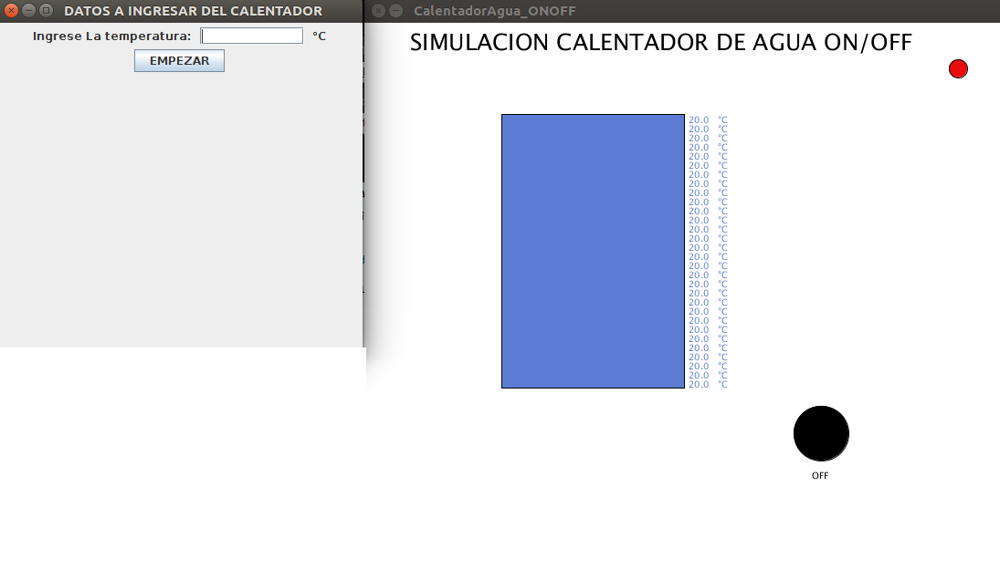
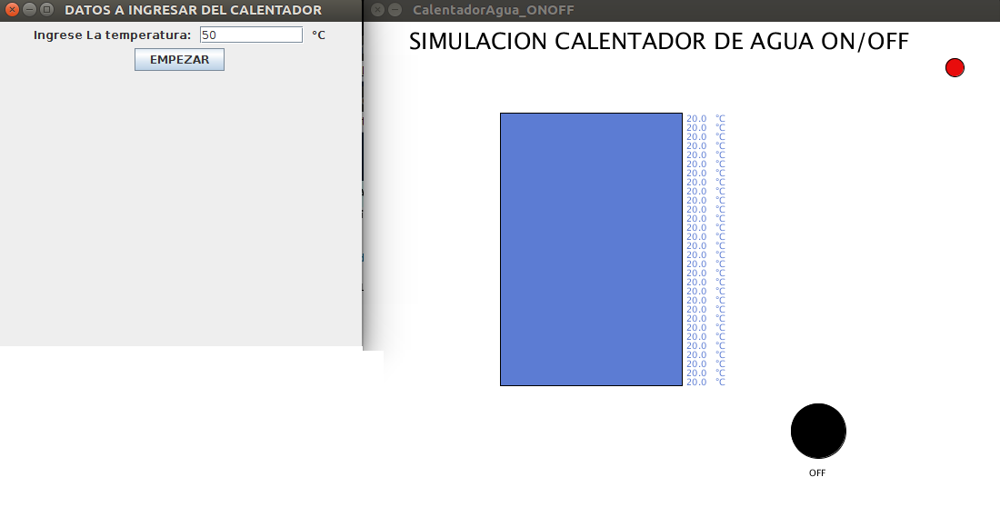
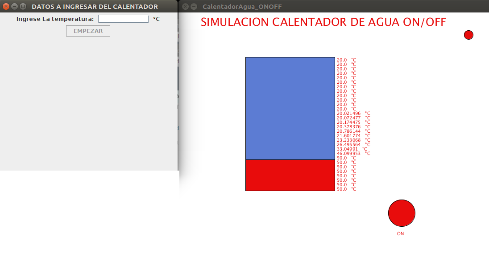
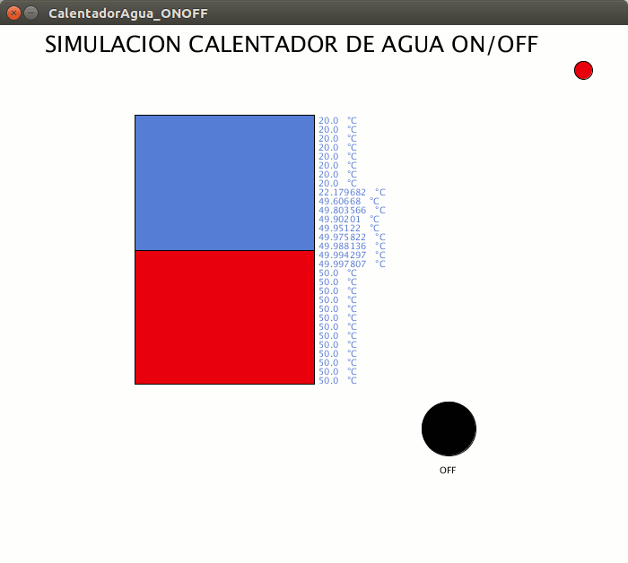
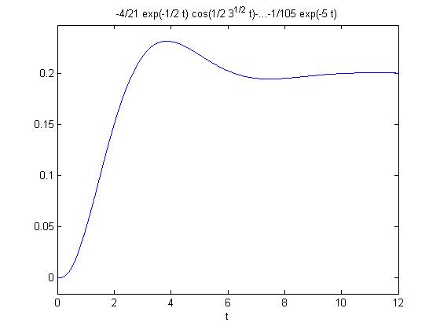

# CalentadorAgua_ONOFF
La aplicación permite simular y controlar la temperatura X de un Calentador de Agua de manera automática.

## ¿Cómo fucniona la aplicación?

Al abrir la aplicación en Processing, primero muestra dos ventanas (Imagen-1): Una para ingresar la temperatura que se quiere controlar y la otra la simulación del calentador de Agua.

Primero hay que ingresar la temperatura de punto de control, en este caso 50°C (Imagen-2) y darle en el botón empezar.

Posteriormente la simualción arrancará como se muestra en la Imagen 3.

Y por ultimo, al llegar la temperatura a 50°C el algoritmo o software controla el aumento y disminución de la temperatura manteniendola en ese punto.

## Gráfica de Control

El proceso es similar a la siguiente gráfica (coordenada X: tiempo y Y: Temperatura), empieza con una temperatura 0°C va subiendo hasta 0.25°C, luego baja y se mantiene en 0.2°C o en el caso del ejemplo anterior en 50°C.

